# InTab tutorial

Open `InTabCSharp/InteractiveTable.sln` in Visual Studio, build the project, and run it.

To try the physics sandbox without a camera or projector, drag stones from the bottom bar onto the simulation window and click **Play** on the right.

---

## Introduction

InTab is an interactive-table sandbox. The table reacts to physical **stones** — objects with a recognition mark that the application can detect and interpret.

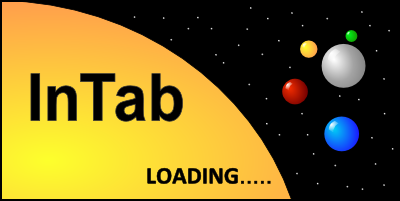

**Author:** Adam Vesecky

The project was a semester assignment at the Department of Computer Graphics and Interaction ([dcgi.felk.cvut.cz](https://dcgi.felk.cvut.cz)) in the Multimedia 1 course in 2012. The goal was an interactive table in the style of a sandbox: the user places stones on the surface, and the application recognizes them.

InTab models a simple physical system with gravity (attractive and repulsive), reflection, thermodynamics (entropy), and a black-hole model. A large set of user settings can produce very different system behavior.

The program also works without a projector. The simulation window lets you add stones with the mouse.

### Software and hardware requirements

**Hardware**

- Processor: Intel Core 2 Duo 2300 MHz
- Memory: 1024 MB DDR2
- Graphics card: any (not used)
- Sound card: not used
- Camera: PAL resolution, lens diameter at least 1 cm

**Software**

- Operating system: MS Windows XP or later
- .NET Framework 4.0

### Getting to know the program

The main window has four areas:

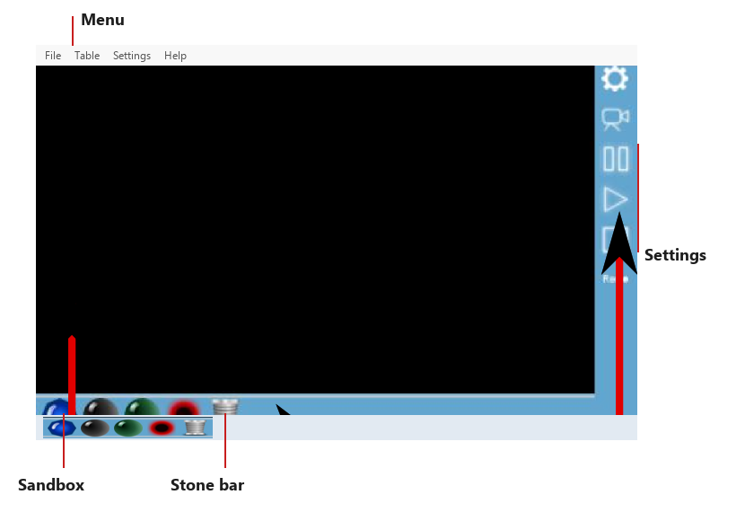

**Menu**

- **File** — load and save the whole system. **Warning:** stones from a loaded system can no longer be controlled.
- **Table** — open the output window. It shows the same picture as the sandbox and is meant for the projector. **Warning:** to save CPU time, only one display panel is active at a time.
- **Settings** — user settings, table calibration, and contour settings.
- **Help** — show this help.

**Sandbox**

Graphical output of the physical system. When no projector is connected, use this panel to test the simulation (stones added with the mouse).

**Stone bar**

Individual stones, including a trash can for deleting them. See [Stones](#stones).

**Settings**

Start or stop the physics thread and turn recognition on or off. See [Environment settings](#environment-settings).

### Possible issues

1. **The program crashes often.**  
   The camera is the usual cause. Camera access goes through external libraries, and a connection fault can raise an uncatchable error. In Device Manager, disable every camera except the one used for recognition.

2. **Stones are not recognized in contour settings.**  
   Try changing the ICF and ACF factors (at the bottom). They control how strictly contours must match. The program must find a contour first, then compare it. **Show contours** draws every contour found at that moment. If your object is missing, the shape may be too weak, too complex, or not contrasty enough. Contours also have to fall into a certain size range.

3. **Stones are not recognized at runtime.**  
   Use **Preview** (the second button on the right settings strip). If stones appear there, the system is probably paused. Start it with **Play**.

4. **The program treats non-stones as stones.**  
   ICF/ACF is probably too low. Raise it in contour settings.

5. **Several stones of the same type are not recognized.**  
   This is a known limitation. Add stones of the same type one by one, not all at once.

6. **Particles do whatever they want.**  
   The system should be closed, but rounding errors mean particles do not lose energy on their own. In the physics settings, under **Particles**, enable **Energy loss** and set the slider above 5.

7. **The program is too slow.**  
   Speed depends on camera resolution, the number of contours in the database, comparison-block size, the number of found stones, the number of particles (including those that left the table), and the system settings. Large particles draw more slowly than small ones.

8. **The camera image is completely white.**  
   **Gamma** in contour settings is probably 0. Set it to at least 1.0.

9. **I do not like the program at all.**  
   This should be rare. If it happens, deleting the program from the hard drive solves it efficiently.

---

## Physical environment

### Stones

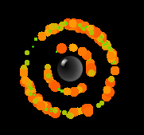

**Graviton** — a gravity stone. It attracts every particle around it.

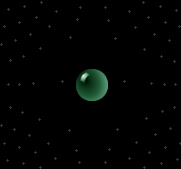

**Magneton** — like the graviton, but repulsive in every direction.

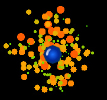

**Generator** — creates particles. Many generation parameters can be tuned.

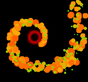

**Black hole** — a simplified mathematical model. It steers particles along a spiral and absorbs them.

### Environment settings

#### User settings

Open **Menu → User settings**.

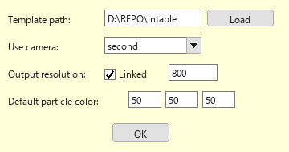

- **Template path** — default path to stone templates, loaded on every start.
- **Use camera** — camera to use. Names come from the DirectShowNet library and Device Manager.

  **Warning:** camera communication happens in DLL libraries. Errors such as a dropped camera connection cannot be caught in the application.

- **Output resolution** — always keeps the same aspect ratio as the main window. With **Linked** checked, the output window uses the same resolution as the graphics panel. Uncheck it to set the output width in pixels; height is computed. **Enlarge the physical system by enlarging the main window.**
- **Default particle color** — used when color gradients are off. Values are 0–255 for red, green, and blue.

#### Stone bar

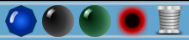

From left to right: **Generator**, **Graviton**, **Magneton**, **Black hole**, and the **trash** for deleting stones.

Hold the left mouse button and drag a stone onto the graphics area. Delete a stone with **Stop** on the left panel, or drag it to the trash. Right-click a stone to open its [local settings](#local-settings).

#### Computation-thread panel

- **Gear** — show or hide the full physics settings panel.
- **Camera** — camera preview with recognized contours. **Warning:** this works only while the recognition thread is running.
- **Pause** — pause the physical system.
- **Play** — start the system.
- **Stop** — reset the system and delete all particles and stones.
- **Rec** — start stone recognition.
- **Screen** — draw into the simulation window.
- **Projector** — draw into the output window.

#### Object settings

##### Global settings

If a stone has no local settings, it uses the global ones. Particles always use global settings.

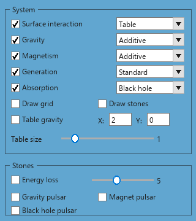
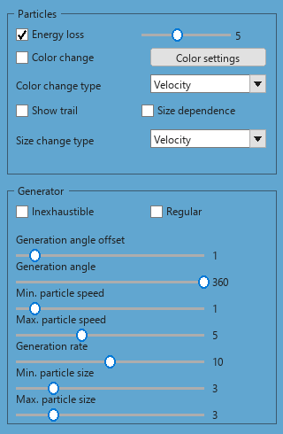

**System**

- **Surface interaction** — bounce particles off the table edges. The only option is interaction with the table.
- **Gravity** — Additive, Average, or Multiplicative.
  - **Additive** — like planets; gravitational effects are summed.
  - **Average** — the total effect is the average of all contributions.
  - **Multiplicative** — experimental, uses logarithms. Give particles a higher energy-loss rate for better results.
- **Magnetism** — Additive, Average, or Multiplicative. Same idea as gravity.
- **Generation** — Standard or Strange.
  - **Standard** — particles spawn in a random direction with random speeds from the generator settings.
  - **Strange** — the spawn angle increases over time.
- **Absorption** — Black hole, Recycle, or Selective.
  - **Black hole** — every particle in range is absorbed.
  - **Recycle** — absorbed particles are returned to a generator if one exists.
  - **Selective** — a particle is absorbed with a given probability.
- **Draw grid** — draw a gravity grid. Points deform with gravitational influence.
- **Draw stones** — draw stones in the output window as colored squares: blue generator, green graviton, yellow magneton, red black hole. Useful when calibrating the camera.
- **Table gravity** — extra gravity along X and Y.
- **Table size** — the table size follows the main window. This slider multiplies that size (useful for the output window so you do not have to resize the main window).

**Stones**

- **Energy loss** — stones lose energy at the chosen rate. **Warning:** particles that have lost energy never get it back.
- **Gravity pulsar** / **Magnet pulsar** / **Black hole pulsar** — the stone’s energy oscillates.

**Particles**

- **Energy loss** — particles lose energy at the chosen rate.
- **Color change** — particles change color. **Color settings** opens the gradient dialog.
- **Color change type** — Gravity, Velocity, Weight, or Size.
- **Show trail** — draw each particle’s path. **Warning:** trails are expensive.
- **Size dependence** — particle size follows gravity, velocity, weight, or size. **Reset** restores the previous sizes.

**Generator**

- **Inexhaustible** — generate particles forever.
- **Regular** — the same number of particles every iteration.
- **Generation angle offset** — start angle (0–360).
- **Generation angle** — maximum angle from the offset (360 means every direction).
- **Min. / Max. particle speed**
- **Generation rate** — maximum particles per iteration.
- **Min. / Max. particle size**

##### Local settings

Right-click a stone in the simulation window. A stone with local parameters no longer follows the global settings.

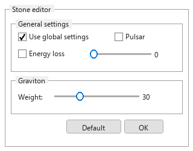

The screenshot shows graviton settings. **Default** loads standard values. **Warning:** if **Use global settings** is checked, the stone follows the global settings, not the local ones.

##### Color settings

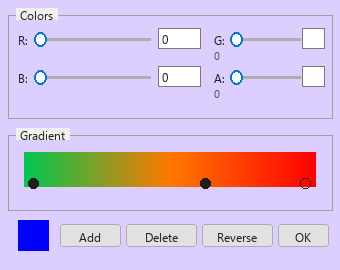

Open this dialog with **Color settings** in the global particle panel.

The gradient rectangle shows the color ramp. The thin strip above it is the alpha channel (white = fully opaque, black = fully transparent).

Drag a marker with the left mouse button. **Add** creates a marker. **Delete** removes the selected marker. **Reverse** swaps the first and last markers.

Click a marker to edit RGBA (0–255) with sliders or by typing. The resulting color is shown in the small rectangle.

**Warning:** a projector has a lower dynamic range. During recognition, keep alpha around half of the usual values. If colors are too bright, the camera will struggle to see the stones.

Click **OK** to close the dialog. If the system is running and you are tweaking values, hold **Shift** — settings are saved without closing the dialog.

### Simulation

Add at least one generator to the surface and click **Play**.

**Example pictures**

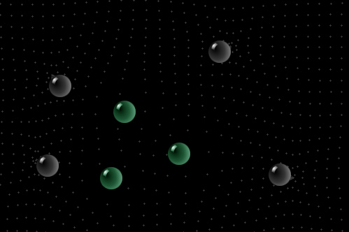

The drawn grid shows gravitational influence.

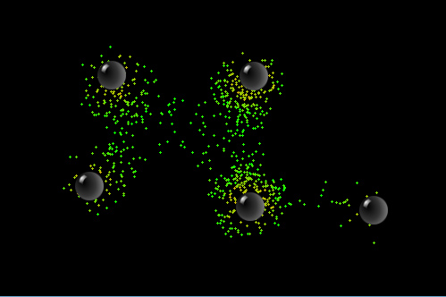

Gravity stones.

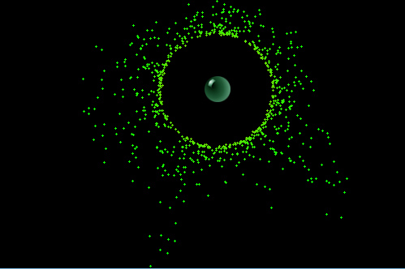

Magneton repulsion.

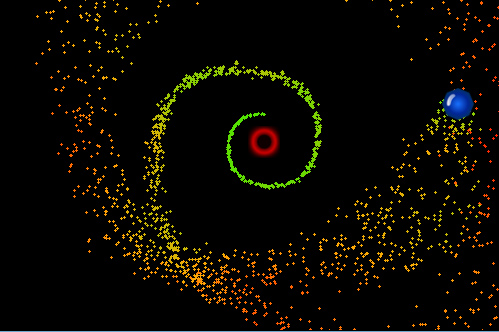

Black hole.

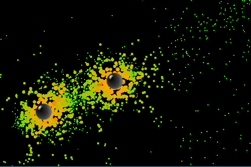

Velocity-dependent particle size.

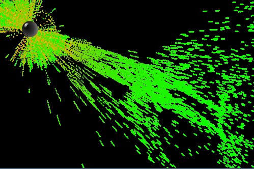

Particle trails.

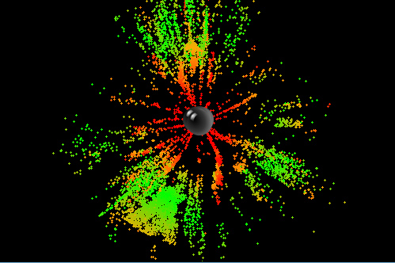

Explosion caused by a sudden change in particle energy-loss settings.

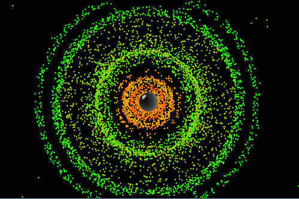

Another explosion.

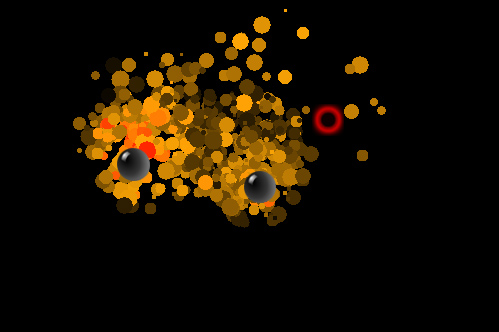

Color gradients that start at black let particles emerge from darkness.

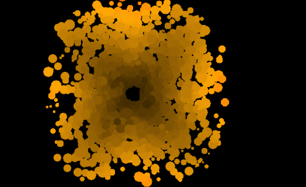

Black hole in the output window — drawing quality is higher here.

---

## Interactive table

### Contour detection

Recognition is fairly involved. The program first applies the filters you set (gamma, dilation, erosion, blur) to the camera image or a loaded picture. Edge detection and a Canny threshold then turn the image into a binary picture where brightness changes become contours. Each contour is converted to a cyclic list of complex-number vectors, as in the figure below. Those vectors are compared with the database using your similarity coefficient and maximum search angle (180° allows any rotation).

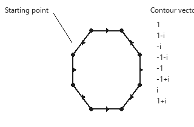

Conversion of the digit 0 into vectors.

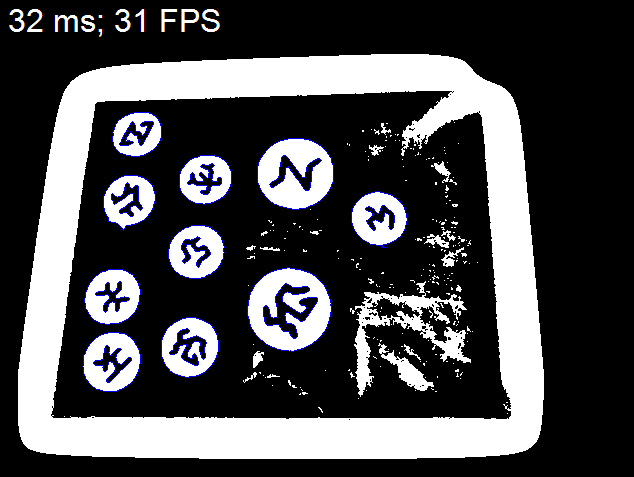

Binary form of the captured image.

#### Contour GUI

Open **Settings → Contour settings**. The left strip loads templates and images, the center shows the camera feed (and redraw time in milliseconds, used for FPS), and the right panel holds the settings.

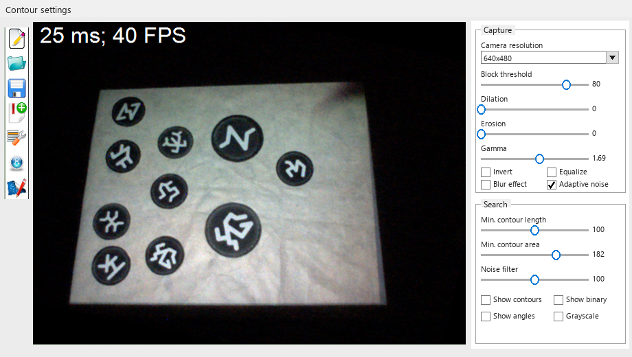

**Toolbar**

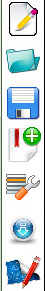

1. Create a new template (contour) database
2. Open an existing database
3. Save the database
4. Add a recognized contour to the database
5. Show every contour in the database
6. Load an image for recognition
7. Assign stones and settings to contours

#### Designing stones

The recognition mark must contrast sharply with its background. A small camera lens adds a lot of noise. If the projector draws particles on top of a mark, that area overexposes and the contour is lost.

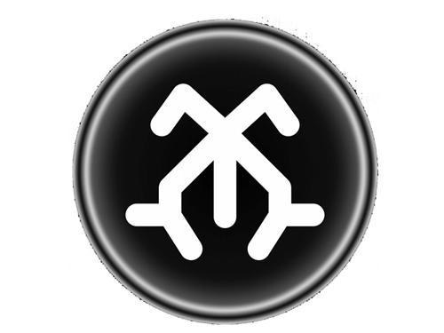

One of the stones designed during testing.

The program needs **continuous** shapes. On the first row, A and B are two contours. On the second row they become a single contour. If anything breaks the outline, the program will not find it.

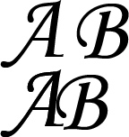

**Warning:** complex contours are harder to recognize; simple ones are easier to confuse with random objects in the image.

Add contours from images (toolbar button 6) rather than from the live camera. A still image is cleaner, so the program remembers the shape without noise.

#### Detection settings

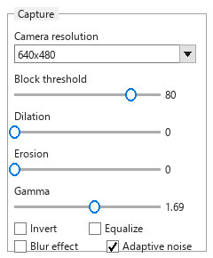
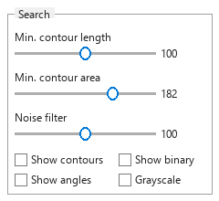

- **Camera resolution** — 320×240 or 640×480. Other camera sizes are scaled down.
- **Block threshold** — size of the blocks used to search for contours. **Warning:** smaller blocks cost more CPU time.
- **Dilation** — soften edges.
- **Erosion** — suppress edges.
- **Gamma** — inverted scale. 0 is maximum (fully white image).
- **Invert** — invert colors; sometimes helps recognition.
- **Equalize** — histogram equalization; poor choice when there is a lot of noise.
- **Blur effect** — reduces noise but makes contours less sharp.
- **Adaptive noise** — one of the noise-suppression methods.
- **Min. contour length** — shortest contour the program will accept.
- **Min. contour area** — minimum interior area.
- **Noise filter** — applied after the basic filters; usually the most effective.
- **Show contours** — draw every found outline.
- **Show binary** — show the image as the program processes it.
- **Show angles** — show each contour’s rotation.
- **Grayscale** — display only; does not change recognition.

#### Setting up recognition

1. Create a new database with the first toolbar button.
2. Place a contour in front of the camera, or load an image with toolbar button 6. The image must be 640×480, or at least 4:3, or it will be distorted.
3. Enable **Show contours** and tune gamma, the noise filter, and the other settings until the contour is outlined in blue without errors.
4. Click toolbar button 4, pick the contour you wanted, give it a unique name, and add it to the database. Never give two contours the same name.

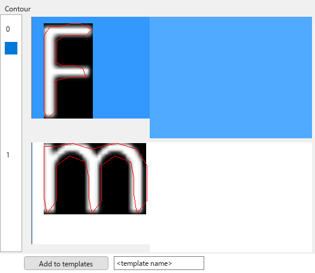

List of recognized templates.

Toolbar button 5 shows every stored contour. You can delete ones you do not want.

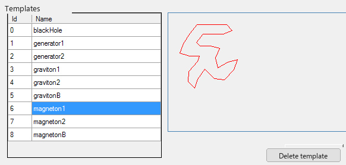

List of saved contours.

5. Test recognition on the camera and refine the settings. Then set **comparison**:

- **MAX ACF average** — a lower value cares about contour size; a higher value ignores size differences.
- **Minimum ACF** — autocorrelation; the chance of a match against itself. Lower values recognize more easily but also mis-identify more often.
- **Minimum ICF** — like ACF, but a lower value recognizes symmetric and skewed contours more easily.
- **Comparison angle** — angle used when comparing contours. 180° allows any rotation.

6. When every contour is recognized reliably, assign a physical function to each one.

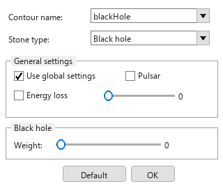

Functional assignment to physical objects.

Pick a contour name, then a stone type and its settings. **Default** loads standard values. **Use global settings** makes the object follow the global settings, the same way local settings work in the simulation.

7. Calibrate the camera.

### Camera calibration

A poorly calibrated camera places functional objects in the wrong position. There are two modes: **rectangle** (camera directly above the table) and **perspective**.

Open **Menu → Camera calibration**.

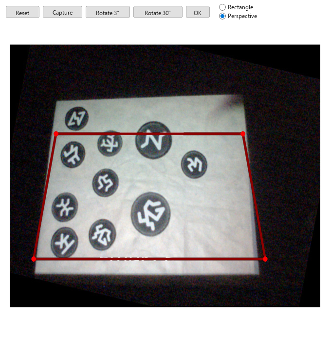

**Buttons**

- **Reset** — clear the whole setup
- **Capture** — grab a frame from the camera
- **Rotate 3°** — rotate the image 3° clockwise
- **Rotate 30°** — rotate the image 30° clockwise
- **OK** — save changes
- **Rectangle** — rectangle mode
- **Perspective** — perspective mode

**Calibration steps**

1. Aim the camera so the table fills as much of the frame as possible.
2. Rotate the image in the dialog until it is aligned.
3. Switch to rectangle mode. Click two points, left to right and bottom to top. The other two points are added and a rectangle is drawn.
4. Drag a corner to resize. Drag an edge to move the rectangle.
5. Switch to perspective mode.
6. Drag the **top-left** point toward the right. The right point follows. Never do perspective the other way around.
7. Click **OK** to save.

**Live calibration**

Perspective distortion is sometimes computed incorrectly. Check it like this: open **Table → Output window**, move that window onto the extended desktop, press **Play** and **Record**, and enable **Draw stones** in the physics settings. Put stones in all four corners of the table. The colored squares should appear in the center of each stone.

Tune perspective by watching those squares. If the distortion is too strong, make the rectangle about 30–50% shorter than the real table and keep the width, as in the screenshot above.

Calibration should take no more than 7 minutes. With a camera on a tripod you only need to do it once.

### Launching the table

Once contours are set and the camera is calibrated, start the system. The projector must be an **extended desktop**.

1. Open **Table → Output window** and drag that window onto the projector. Enable drawing into the output window with the projector button on the right of the main window. It is best to disable drawing into the main window (the screen button above it).
2. Double-click the output window for full screen. Press **Play** and **Record** to start recognition.
3. Resize the **original** window — the system size and the output window follow it. For a higher output resolution (by default the output matches the main window), set the resolution in user settings.
4. Keep changing the global settings to get more interesting effects.
5. Enjoy the interactive table.

---

Copyright 15.5.2012, Adam Vesecky.
