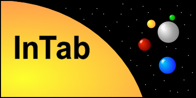
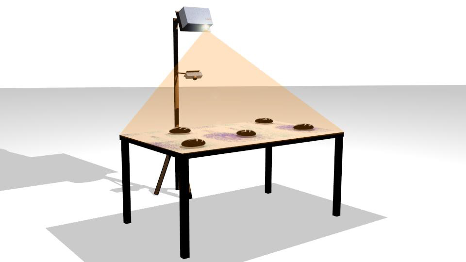
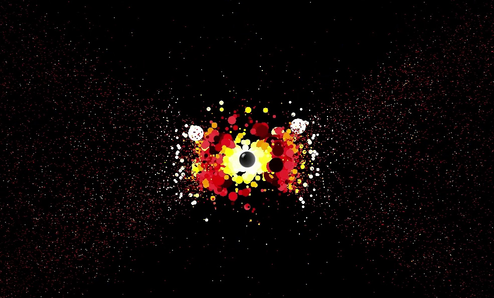
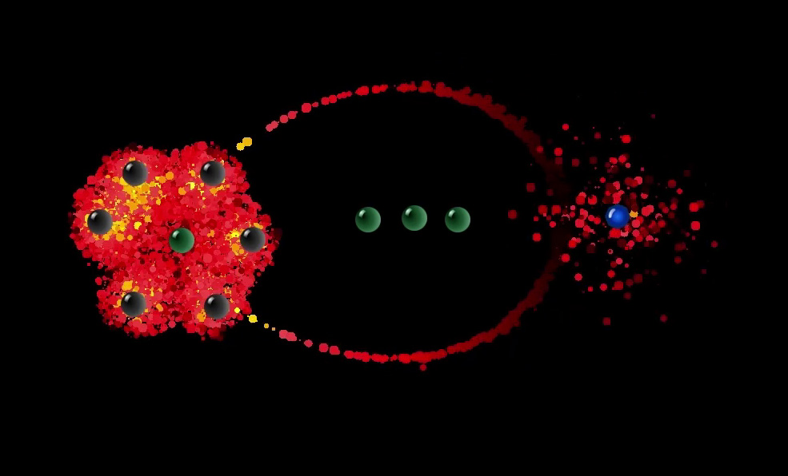
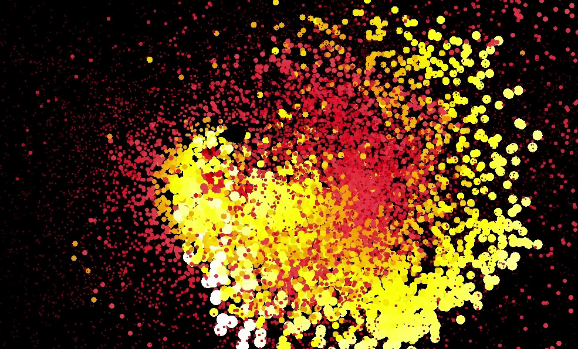

## What's the InTab?

**Interactive table** - Augmented reality project made for *Institute of Intermedia in Prague* in 2012.

**Budget**: over 300 working hours

InTab projects a finely configurable particle system onto a surface (a wall or a table). Emitted particles interact with stones that contain symbols, recognizable by simple ICF/ACF algorithms. The table is captured on a camera thanks to which the application can process captured images and provide a feedback to the particle system.

<a href="https://www.youtube.com/watch?v=Gx1UshgQTR0" target="_blank">**Demonstration video**</a>

The application can be used also without any setup - it contains a simulation window into which all stones can be placed manually. 

## Platforms
Windows - .NET 3.5

## Architecture 

The project was written in C# as a .NET WPF application in 2012. Althought it doesn't provide any GPU-rendering (all calculations are done on CPU), thanks to several optimizing techniques the whole setup was able to display over 100 000 particles, interacting with 10 stones on a Core-i3 notebook, having 30 FPS.

## How to use it
[Tutorial](Docs/install.md) - getting started

---

## LICENSE and ATTRIBUTIONS

InTab is made available under the [MIT](http://opensource.org/licenses/MIT) license.